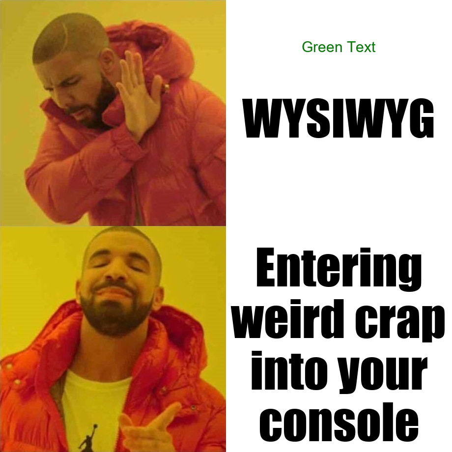
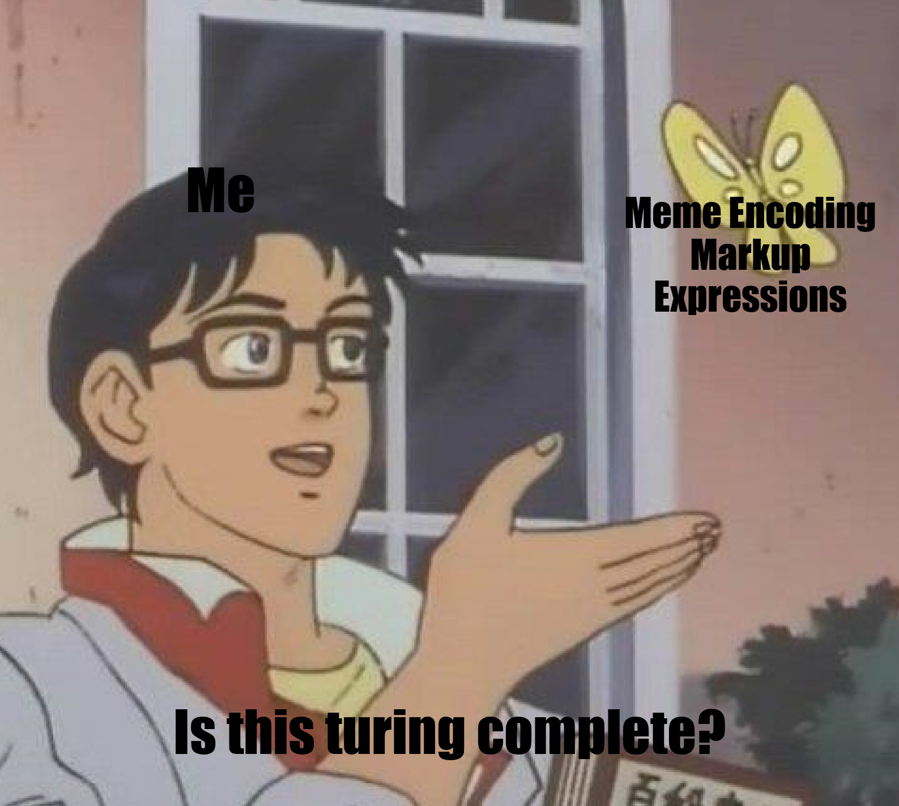

# MEME
Meme Encoding Markup Expressions - A grammar for generating memes.

The full language spec can be found [here](./language_specs.md).  
This repository contains a references implementation of the compiler ([`src/console.py`](./src/console.py)) 

## Installation

Setting up the compiler
1. Run `pip install git+https://github.com/schorrm/meme.git`. Alternatively, clone and then run `python ./setup.py install` from the project root to install the compiler. 
You should now have access to `meme -h` (or `meme.exe -h`) from your terminal.
2. Clone the [FML (Foundational Meme Library)](https://github.com/schorrm/fml) to `~/.local/lib/meme/fml`
3. Start memeing!

## Generating Memes
The simplest memes can be generated from relavtively simple strings consisting of an image specifier and some text fields. 
For example, `/M:drake/T:WYSIWYG/T:Entering weird crap into your console/` generates: 
The language also supports placing text at arbitary locations, changing text color, font size, etc:
`/M:drake/T:WYSIWYG/T:Entering weird crap into your console/T:Green Text;CL:green;F:Arial:30/`

It even handles memes with weird text positions for you, like with this pigeon meme:
`/M:pigeon/T:Me/T:Meme Encoding Markup Expressions/T:Is this turing complete?/` (we're pretty sure its not) 

## Thanks
Thank you to [Jace Browning](https://github.com/jacebrowning) for his [memegen](https://github.com/jacebrowning/memegen) website which inspired this project. Additionally, his code was a very helpful reference. 
Thank you to pillow for being great and defining much of our default behaviour through their well chosen defaults. 
Spongebob, for being an endless font of fantastic memes.
