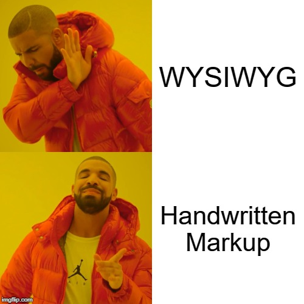

# MEME Specs and Language Standard

## A Meme Expression

A meme expression is formed from blocks. As of now there are three block hierarchies in the standard:

- C: Composite (this contains memes)
- M: Meme (denotes an image and its text)
- T: Text (a text block)

Scoping is C -> M -> T.

Formatting can be either included in a block or a block of its own. If it is its own block, it applies until the current scope is ended, if it is defined on the block, it applies throughout the scope.

<!-- TODO: Make the documentation self-hosting -->

For example, the following meme:



Is properly encoded as:

```meme
/M:drake;FF:Helvetica/T:WYSIWYG:r1/T:Handwritten Markup:r2/
```

Where the termination of the M block is emplied by the end of the encoding.

Each block has a base tag (either a style tag to modify the style or a scoping type such as C, M, or T). Colons `:` chain together arguments in `TAG:required:optional` order, and then `;` ends tag arguments. So `/T:WYSIWYG:r1;F:impact:20pt/` denotes a Text block (T), WYSIWYG being the text (mandatory), followed by font styling of impact, 20pt.


```
OPT Composite
    grid size (defaults to minimum required to hold all children (if a number of children isn't explicitly given, all subsequent memes until the close tag are children **)
    OPT position (defaults to ***)
    -----
    END - can only appear alone, specifies the end of the last composite tag
Meme/Image
    OPT image (defaults to empty text region)
    background (defaults to white)
    OPT size (defaults to minimum to contain all elements)
    OPT position in composite grid (defaults to ***)
Text/String
    string
    OPT location (top left, top right) (Defaults to ****)
    OPT rotation (defaults to horizontal)
    OPT formatting subtags (defaults to current stack)
Formatting (at least one)
    OPT Font (at least one)
        OPT size (defaults to ??? TBD)
        OPT face (defaults to IMPACT)
        OPT outline size (defaults to ??? TBD)
    OPT Color (at least one)
        OPT fg (defaults to black)
        OPT outline color (defaults to transparent/white TBD)
        OPT bg (defaults to transparent)
    OPT css-style (bold, ul, itallics, strikethrough etc?) (Defaults to none)
    OPT halign (left/right/center) (defaults to center)
    OPT valign (top/bottom/center) (defaults to center)
    ----
    OPT END - can only appear alone, pops the last format tag.

Formatting end tag is just an empty formatting tag.
A composite end tag is ???

** root grid size defaults to minimum neccessary to contain child memes. For width this will be the largest explictly given column id in an immediate child's location, for height it will be whatever is necessary

*** default grid position of the first immediate child of a composite tag is 1,1. Each following child is placed in top-to-bottom, left-to-right (order TBD), respecting the composite tag's grid sizing

**** First text tag in a meme defaults to top. subsequent tags following order:
top->bottom->center->UB
rtop->rbottom->rcenter->(r)UB
ltop->lbottom->lcenter->(l)UB
n->n+1 (1-indexed)
ln->ln+1 (1-indexed)
rn->rn+1 (1-indexed)
```
