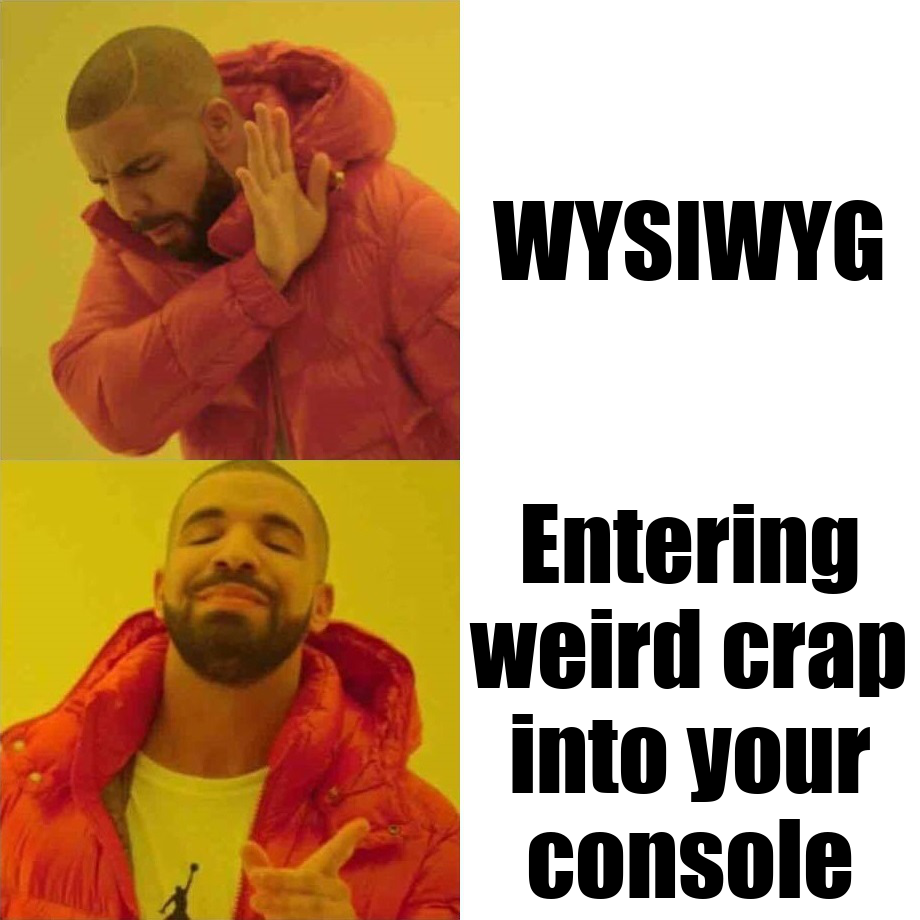

# MEME Specs and Language Standard

## A Meme Expression

A meme expression is formed from blocks. As of now there are three block hierarchies in the standard:

- C: Composite (this contains memes)
- M: Meme (denotes an image and its text)
- T: Text (a text block)

Scoping is C -> M -> T.

Formatting can be either included in a block or a block of its own. If it is its own block, it applies until the current scope is ended, if it is defined on the block, it applies throughout the scope.

For example, the following meme:



Is properly encoded as:

```meme
/M:drake/T:WYSIWYG/T:Entering weird crap into your console/
```

Where the termination of the M block is emplied by the end of the encoding.

Each block has a base tag (either a style tag to modify the style or a scoping type such as C, M, or T). Colons `:` chain together arguments in `TAG:required:optional` order, and then `;` ends tag arguments. So `/T:WYSIWYG:r1;F:impact:20/` denotes a Text block (T), WYSIWYG being the text (mandatory), followed by font styling of impact, 20pt.
